# Week 2

## Bài 1: GET list + POST create

### Server log

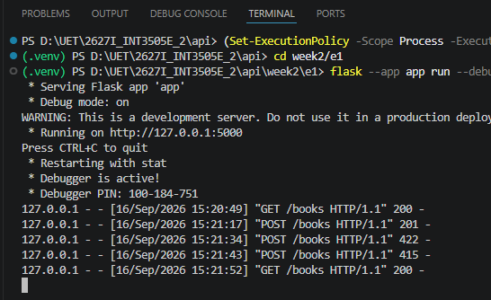

### `GET /books` - Lấy danh sách

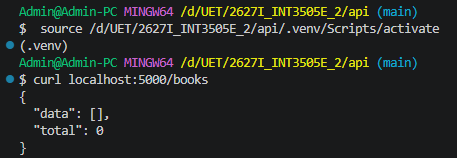

### `POST /books` - Tạo resource mới

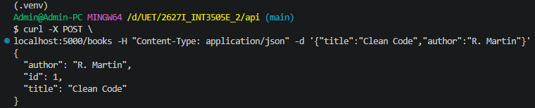

### `POST /books` thiếu field - `422 Unprocessable Entity`

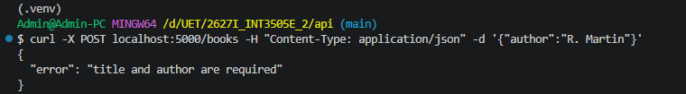

### `POST /books` thiếu Content-Type - `415 Unsupported Media Type`

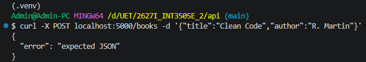

## Bài 2: PUT + PATCH + DELETE

### Server log

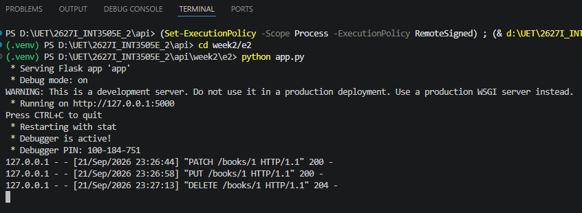

### `PATCH /books` - cập nhật 1 field

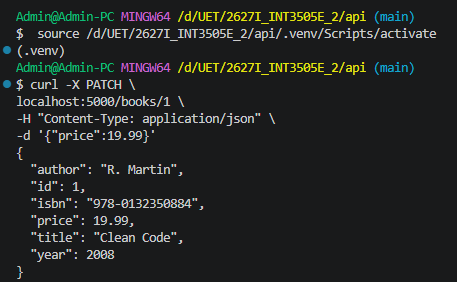

### `PUT /books` - cập nhật toàn bộ field

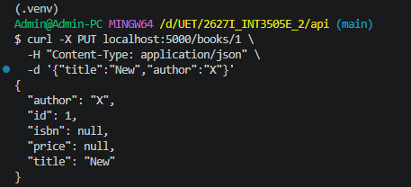

### `DELETE /books` - Xoá

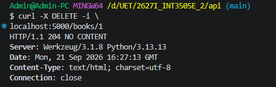

## Bài 3: Pagination + Filtering

### Server log

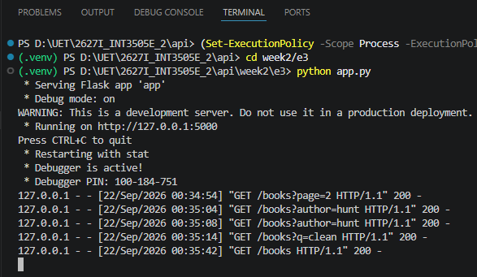

### Pagination với page và size

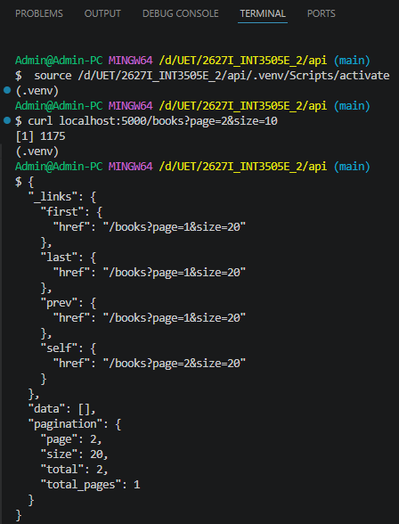

### Lọc theo tên tác giả

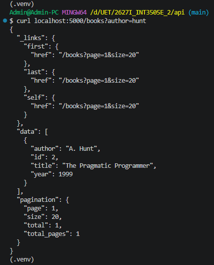

### Lọc theo tựa đề

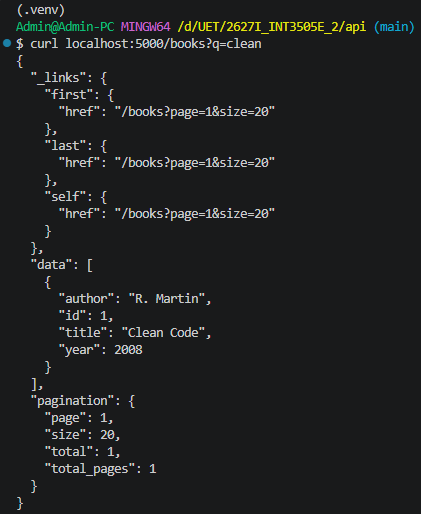

### Yêu cầu response định dạng JSON

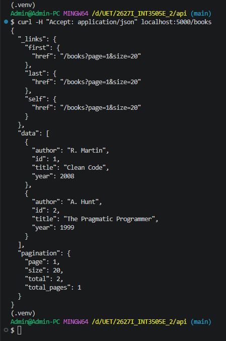

## Assignment Bài 1:

### Server log:

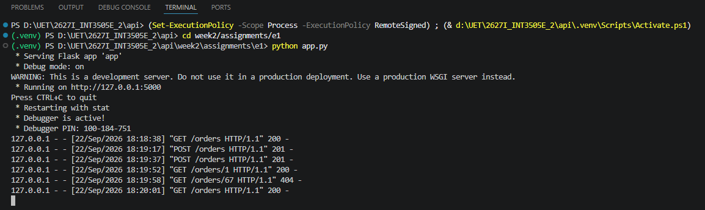

### `GET /orders/` - Lấy danh sách ban đầu

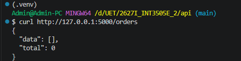

### `POST /orders/` - Tạo order mới

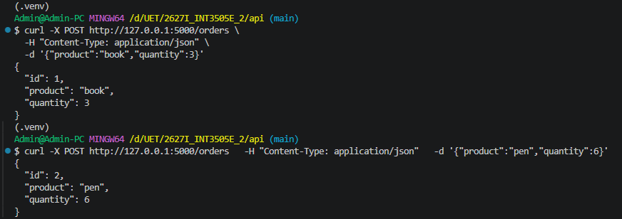

### `GET` order vừa tạo - `200 OK`

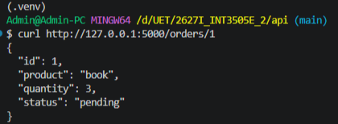

### `GET` order không tồn tại - `404 Not Found`

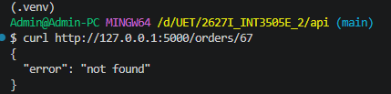

### `GET /orders` - Lấy danh sách sau khi tạo

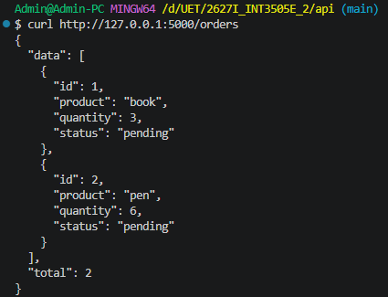

## Assignment Bài 3:

### Server log

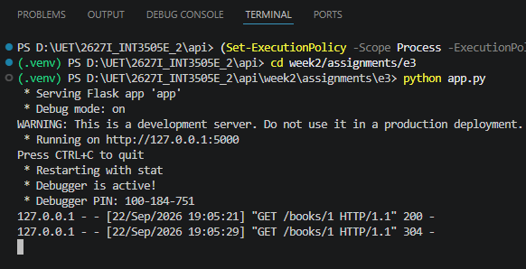

### `GET /books/1` - Lấy book lần đầu để lấy ETag

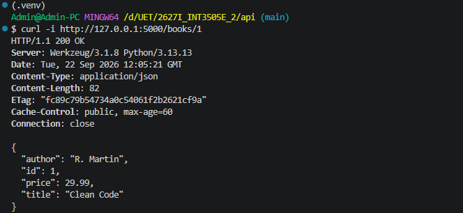

### `GET /books/1` với header `If-None-Match` - `304 Not Modified`

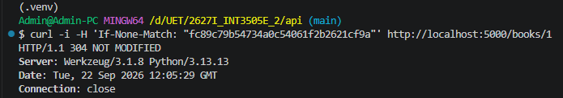