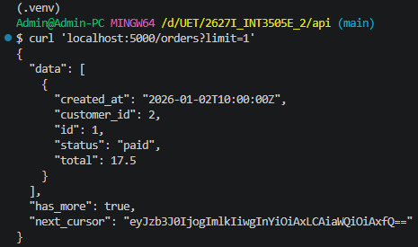
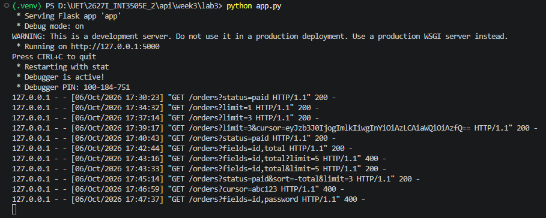
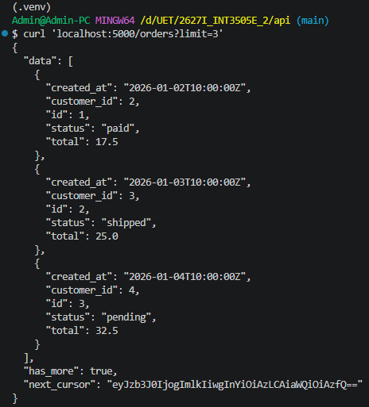
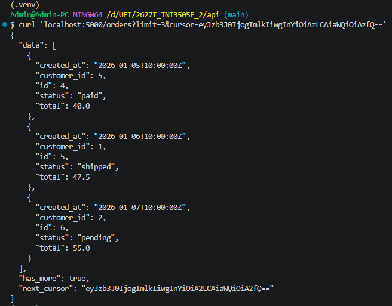
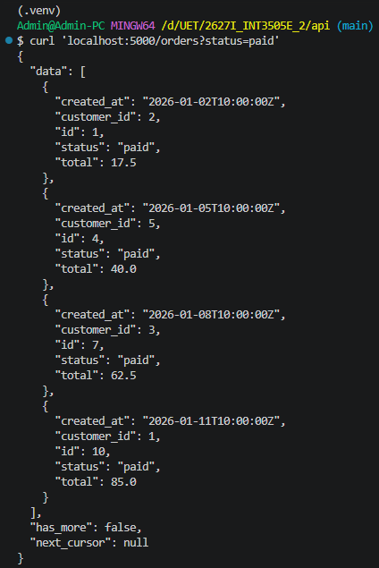
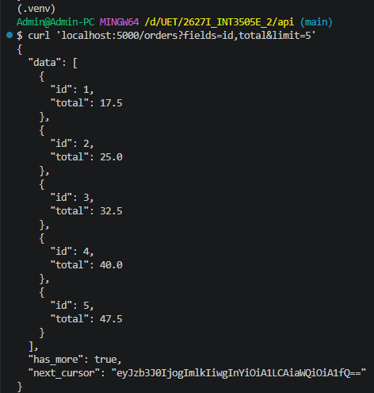
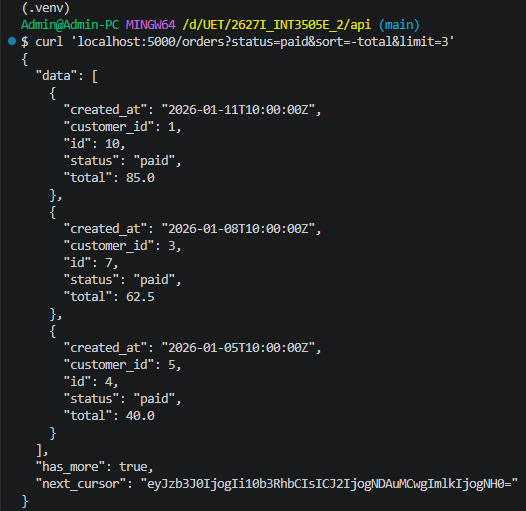
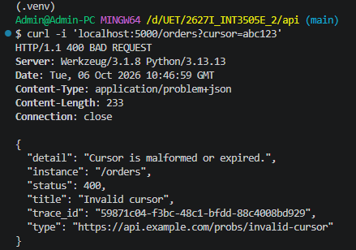
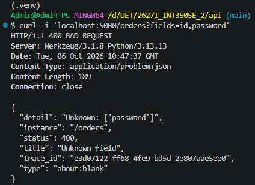

# Lab 3: Triển khai `/orders` có Cursor Pagination

## Cấu trúc một response

## Results

### Server log

### Test với limit nhỏ, lấy `next_cursor`

### Dùng `next_cursor` từ response trước để lấy trang kế tiếp

### Filter theo `status=paid`

### Sparse fieldsets

### Sort + Filter

### Cursor hỏng

### Invalid field

